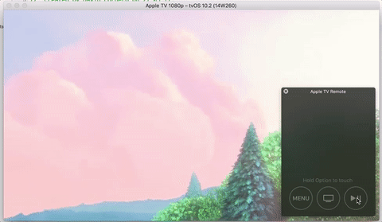

# Radar-31283089

tvOS: AVPlayerViewController reacts to Pause when isUserInteractionEnabled is set to false

· Open radar: https://openradar.appspot.com/31283089

# Update

This issue was resolved in tvOS 11

# Description
Triggering the gesture Pause with Siri Remote in an instance of AVPlayerViewController with the property isUserInteractionEnabled set to false, reacts to the interaction pausing the player.

On the other hand, as expected, subsequent presses of the Play/Pause button are not reacting afterwards.

# Steps
In this repo you can find a project with an instance of AVPlayerViewController playing BigBuckBunny with the isUserInteractionEnabled set to false.

Just run the Application and press the button Play/Pause button on Siri Remote, and the player will stop.

# Expected
The player does not stop

# Version:
tvOS 10.2
